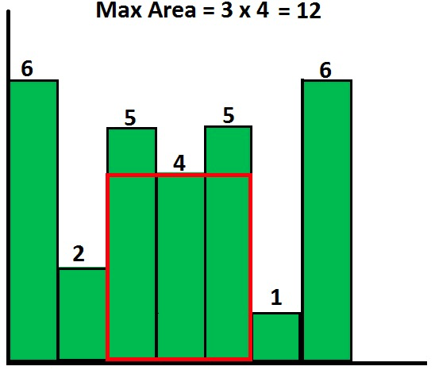

# 笔试题

## 1.[编程题] 大富翁游戏

~~~
时间限制：1秒

空间限制：32768K
~~~

大富翁游戏，玩家根据骰子的点数决定走的步数，即骰子点数为1时可以走一步，点数为2时可以走两步，点数为n时可以走n步。求玩家走到第n步（n<=骰子最大点数且是方法的唯一入参）时，总共有多少种投骰子的方法。

**输入描述:**

```
输入包括一个整数n,(1 ≤ n ≤ 6)
```

##### **输出描述:**

```
输出一个整数,表示投骰子的方法
```

##### **输入例子1:**

```
6
```

##### **输出例子1:**

```
32
```

代码:

~~~
import java.util.*;
public class Main{
    public static void main(String[] args){
        Scanner scan = new Scanner(System.in);
        int num = scan.nextInt();
        System.out.println((int)(Math.pow(2,num-1)));
        
    }
}
~~~

## 2.[编程题] 拼凑钱币

~~~
时间限制：1秒

空间限制：32768K
~~~

给你六种面额 1、5、10、20、50、100 元的纸币，假设每种币值的数量都足够多，编写程序求组成N元（N为0~10000的非负整数）的不同组合的个数。

##### 输入描述:**

```
输入包括一个整数n(1 ≤ n ≤ 10000)
```

##### **输出描述:**

```
输出一个整数,表示不同的组合方案数
```

##### **输入例子1:**

```
1
```

##### **输出例子1:**

```
1
```

代码:

~~~
import java.util.Scanner;  
import java.util.Arrays;
public class Main{
    public static long count(int n) {  
        int coins[] = { 1, 5, 10, 20, 50, 100 };  
        int h = coins.length;  
        long dp[][] = new long[h][n + 1];  
        Arrays.fill(dp[0], 1);  

        for (int i = 1; i < h; i++) {  
            for (int j = 1; j <= n; j++) {  
                int m = j / coins[i];  
                for (int k = 0; k <= m; k++) {  
                    dp[i][j] = dp[i][j] + dp[i - 1][j - k * coins[i]];  
                }  
            }  
        }  
        return dp[h - 1][n];  
    }  
    public static void main(String[] args){
        Scanner sc = new Scanner(System.in);  
        while (sc.hasNext()) {  
            int n = sc.nextInt();  
            long res = count(n);  
            System.out.println(res);  
        }  
        
    }
}
~~~

## 3.[编程题] 最大矩形面积

~~~
时间限制：1秒

空间限制：32768K
~~~

给定一组非负整数组成的数组h，代表一组柱状图的高度，其中每个柱子的宽度都为1。 在这组柱状图中找到能组成的最大矩形的面积（如图所示）。 入参h为一个整型数组，代表每个柱子的高度，返回面积的值。



##### **输入描述:**

```
输入包括两行,第一行包含一个整数n(1 ≤ n ≤ 10000)
第二行包括n个整数,表示h数组中的每个值,h_i(1 ≤ h_i ≤ 1,000,000)
```

##### **输出描述:**

```
输出一个整数,表示最大的矩阵面积。
```

##### **输入例子1:**

```
6
2 1 5 6 2 3
```

##### **输出例子1:**

```
10
```

代码:

~~~
import java.util.Scanner;  
import java.util.Arrays;
public class Main{    
    public static void main(String[] args){
        Scanner sc = new Scanner(System.in);  
        while(sc.hasNext()){  
            int n = sc.nextInt();  
            int[] height = new int[n];  
            for(int i = 0; i < n; i++){  
                height[i] = sc.nextInt();  
            }  
            int MaxArea = 0;  
            int minH = 0;  
            for(int i = 0; i < n; i++){  
                minH = height[i];  
                for (int j = i; j < n; j++){  
                    minH = Math.min(minH, height[j]);  
                    MaxArea = Math.max(MaxArea, minH * (j - i + 1));  
                }  
            }  
   
            System.out.println(MaxArea);  
        }  
        sc.close();
    }
}
~~~

## 4.[编程题] 最长公共连续子串

~~~
时间限制：1秒

空间限制：32768K
~~~

给出两个字符串（可能包含空格）,找出其中最长的公共连续子串,输出其长度。

##### **输入描述:**

```
输入为两行字符串（可能包含空格），长度均小于等于50.
```

##### **输出描述:**

```
输出为一个整数，表示最长公共连续子串的长度。
```

##### **输入例子1:**

```
abcde
abgde
```

##### **输出例子1:**

```
2
```

代码:

~~~
import java.util.Scanner;  
   
public class Main {  
    static String str1;  
    static String str2;  
    static int[][] dp;  
    static int Max;  
   
    public static void main(String[] args) {  
        // TODO Auto-generated method stub  
        Scanner in = new Scanner(System.in);  
        str1 = in.nextLine();  
        str2 = in.nextLine();  
        int len1 = str1.length();  
        int len2 = str2.length();  
        if ( len1 < 1 || len2 < 1){  
            System.out.print(0);  
        }  
   
        dp = new int[str1.length()+1][str2.length()+1];  
        char[] ch1 = str1.toCharArray();  
        char[] ch2 = str2.toCharArray();  
   
        for ( int i = 0 ; i < len1 ; i++){  
            if ( ch1[i] == ch2[0]){  
                dp[i][0] = 1;  
            }  
        }  
   
        for ( int i = 0 ; i < len2 ; i++){  
            if ( ch2[i] == ch1[0]){  
                dp[0][i] = 1;  
            }  
        }  
   
        Max = dp[0][0];  
        for ( int i = 1 ; i < len1 ; i++){  
            for ( int j = 1 ; j < len2 ; j++){  
                if ( ch1[i] == ch2[j]){  
                    dp[i][j] = dp[i-1][j-1]+1;  
                }  
                if ( dp[i][j] > Max){  
                    Max = dp[i][j];  
                }  
            }  
        }  
   
   
        System.out.print(Max);  
        in.close();  
    }  
} 
~~~

